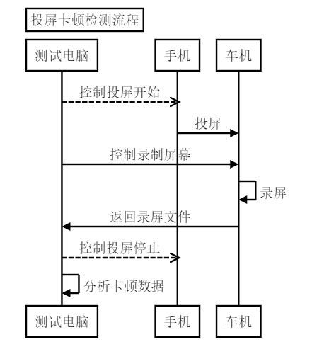

## 测试流程图 ## 

## 技术方案 ##
### 通讯方案 ###
* 测试电脑与手机 === ADB
* 测试电脑与车机 === Tera Term(SSH)
* 手机与车机 === 无线协议

### 录屏方案 ###
ffmpeg固定帧率获取车机显示缓冲区的图片，压缩保存成视频文件。
录屏性能消耗低，视频文件即是车机显示出来的图像，可直接分析车机的播放显示效果。

### 分析方案 ###
从视频文件中解码出每一帧图片，分析相邻帧的图像变化，小于阈值则认为图片未变化，得出播放真实帧率，从而计算出卡顿的时间点。
